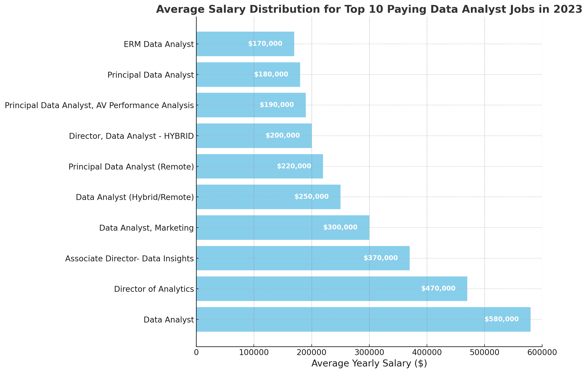
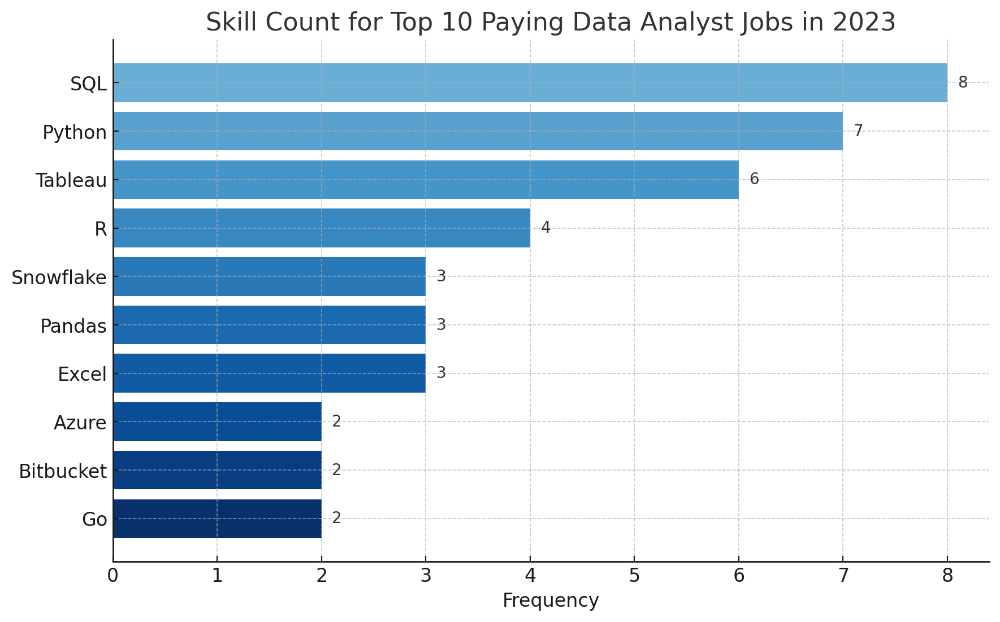
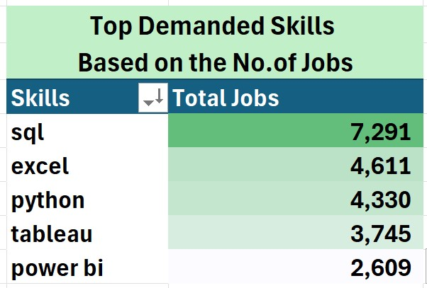
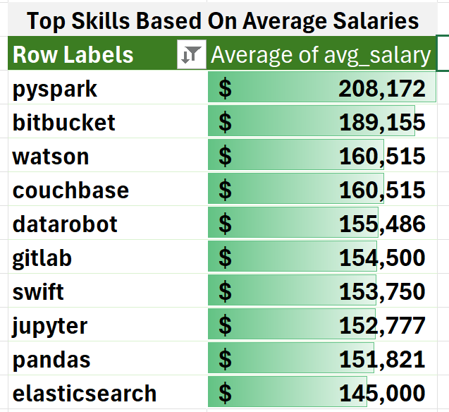

 # Introduction
📊 Dive into the data job market! Focusing on data analyst roles, this project explores 💰 top-paying jobs, 🔥 in-demand skills, and 📈 where high demand meets high salary in data analytics.


🔍 SQL queries? Check them out here: [sql_project folder](/sql_project/)
 # Background
Driven by the need to better navigate the data analyst job market, I embarked on a project to identify top-paying and high-demand skills. My goal was to simplify the process for others to find the most suitable jobs.

This project marks the peak of my SQL learning journey, thanks to Luke Barousse, an outstanding educator who supplied the data and mentorship needed to make it a reality.

Course & Project Link [SQL for Data Analytics](https://lukebarousse.com/sql).

### The key questions I sought to answer with my SQL queries were:

1. What are the top-paying data analyst jobs?
2. What skills are required for these top-paying jobs?
3. What skills are most in demand for data analysts?
4. Which skills are associated with higher salaries?
5. What are the most optimal skills to learn?

 # Tools I used
To thoroughly explore the data analyst job market, I leveraged several essential tools:

- **SQL**: The core of my analysis, enabling me to query the database and extract crucial insights.
- **PostgreSQL**: The database management system of choice, perfectly suited for handling job posting data.
- **Visual Studio Code**: My preferred environment for managing the database and executing SQL queries.
- **Git & GitHub**: Vital for version control and sharing my SQL scripts and findings, ensuring smooth collaboration and tracking of the project.

 # The Analysis
 Each query in this project was designed to explore a specific aspect of the data analyst job market. Here's how I approached each of these questions:

 ### 1. Top Paying Data Analyst Jobs
 To pinpoint the highest-paying roles, I filtered data analyst positions based on average annual salary and location, specifically targeting remote opportunities.This query highlights the most lucrative jobs in the field.

```sql
 SELECT	
	job_id,
    job_title,
    job_location,
    job_schedule_type,
    name AS company_name,
    salary_year_avg,
    job_posted_date
FROM
    job_postings_fact AS jobs
LEFT JOIN company_dim AS companies
    ON jobs.company_id = companies.company_id
WHERE
    job_title_short = 'Data Analyst' AND
    job_location = 'Anywhere' AND
    salary_year_avg IS NOT NULL
ORDER BY
    salary_year_avg DESC
LIMIT 10
```
Here’s an overview of the top data analyst jobs in 2023:

- **Wide Salary Range**: The top 10 highest-paying data analyst positions have salaries ranging from $184,000 to $650,000, showcasing the significant earning potential within the field.
- **Diverse Employers**: Companies such as SmartAsset, Meta, and AT&T are among those offering top-tier salaries, indicating strong demand across various industries.
- **Variety in Job Titles**: There’s a broad spectrum of job titles, from Data Analyst to Director of Analytics, reflecting the wide range of roles and specializations within the data analytics domain.


*Bar graph visualizing the salary for the top 10 salaries for data analysts; ChatGPT generated this graph from my SQL query results*

### 2. Skills for Top Paying Jobs
To determine the skills required for top-paying jobs, I joined the job postings with the skills data, revealing what employers prioritize for high-paying positions.
```sql
WITH top_paying_jobs AS (
    SELECT	
        job_id,
        job_title,
        salary_year_avg,
        name AS company_name
    FROM
        job_postings_fact
    LEFT JOIN company_dim ON job_postings_fact.company_id = company_dim.company_id
    WHERE
        job_title_short = 'Data Analyst' AND 
        job_location = 'Anywhere' AND 
        salary_year_avg IS NOT NULL
    ORDER BY
        salary_year_avg DESC
    LIMIT 10
)

SELECT 
    top_paying_jobs.*,
    skills
FROM top_paying_jobs
INNER JOIN skills_job_dim ON top_paying_jobs.job_id = skills_job_dim.job_id
INNER JOIN skills_dim ON skills_job_dim.skill_id = skills_dim.skill_id
ORDER BY
    salary_year_avg DESC;
```
Here’s an overview of the most demanded skills for the top 10 highest paying data analyst jobs in 2023:

- **SQL** stands out, appearing in 8 of the top positions.
- **Python** is close behind, featured in 7 roles.
- **Tableau** is also in high demand, appearing in 6 positions.
- **Other skills** such as R, Snowflake, Pandas, and Excel are also valued, though to varying extents.


*Bar graph visualizing the count of skills for the top 10 paying jobs for data analysts; ChatGPT generated this graph from my SQL query results*

### 3. In-Demand Skills for Data Analysts
This query revealed the top skills most  requested in job postings for data analysts in 2023

```sql
SELECT
    skills,
    COUNT(skill_to_job.job_id) AS total_jobs
FROM job_postings_fact AS jobs
INNER JOIN skills_job_dim AS skill_to_job
    ON jobs.job_id = skill_to_job.job_id
INNER JOIN skills_dim AS skills 
    ON skill_to_job.skill_id = skills.skill_id
WHERE
    job_title_short = 'Data Analyst'
    AND job_work_from_home = TRUE
GROUP BY
    skills
ORDER BY
    total_jobs DESC
LIMIT 5
```
Here's the oveerview of the most demanded skills for data analysts in 2023

- **SQL and Excel** are crucial, highlighting the importance of solid foundational skills in data handling and spreadsheet management.
- **Programming and Visualization Tools** such as **Python**, **Tableau**, and **Power BI** are increasingly vital, reflecting the growing need for technical proficiency in data visualization and strategic decision-making.


*Table representing the top 5 skills for a data analyst in job postings*
### 4. Skills Based on Salary
Exploring the average salaries associated with different skills revealed which skills are the highest paying.

```sql
SELECT
    skills,
    ROUND(AVG(salary_year_avg),0) AS avg_salary
FROM job_postings_fact AS jobs
INNER JOIN skills_job_dim AS skill_to_job
    ON jobs.job_id = skill_to_job.job_id
INNER JOIN skills_dim AS skills 
    ON skill_to_job.skill_id = skills.skill_id
WHERE
    job_title_short = 'Data Analyst'
    AND salary_year_avg IS NOT NULL
    AND job_work_from_home = TRUE
GROUP BY
    skills
ORDER BY
    avg_salary DESC
LIMIT 25
```
Key Findings on Top-Paying Skills for Data Analysts:

- **Big Data & Machine Learning:** Analysts with expertise in big data technologies (e.g., PySpark, Couchbase), machine learning tools (e.g., DataRobot, Jupyter), and Python libraries (e.g., Pandas, NumPy) tend to command the highest salaries, reflecting the industry’s emphasis on data processing and predictive analytics.
- **Software Development & Deployment:** Proficiency in development and deployment tools (e.g., GitLab, Kubernetes, Airflow) suggests a lucrative intersection of data analysis and engineering, with high demand for skills that enable automation and streamline data pipelines.
- **Cloud Computing:** Expertise in cloud-based tools (e.g., Elasticsearch, Databricks, GCP) highlights the increasing value of cloud computing in analytics, indicating that cloud skills can significantly enhance earning potential in this field.
This version keeps the content intact while offering a fresh perspective.


*Table showcasing the average salary for the top 10 highest-paying skills for data analysts* 

### 5. Most Optimal Skills to Learn
This analysis combined demand and salary data to identify the most strategic skills for data analysts, focusing on those with both high demand and high salaries.

```sql
WITH skill_demand AS (
    SELECT
        skill_to_job.skill_id,
        skills.skills AS skill, -- Assuming 'skills' refers to 'skill_name'
        COUNT(skill_to_job.job_id) AS total_jobs
    FROM job_postings_fact AS jobs
    INNER JOIN skills_job_dim AS skill_to_job
        ON jobs.job_id = skill_to_job.job_id
    INNER JOIN skills_dim AS skills 
        ON skill_to_job.skill_id = skills.skill_id
    WHERE
        job_title_short = 'Data Analyst'
        AND salary_year_avg IS NOT NULL
        AND job_work_from_home = TRUE
    GROUP BY
        skill_to_job.skill_id,
        skills.skills
), average_salary AS (
    SELECT
        skill_to_job.skill_id,
        skills.skills AS skill, -- Assuming 'skills' refers to 'skill_name'
        ROUND(AVG(salary_year_avg), 0) AS avg_salary
    FROM job_postings_fact AS jobs
    INNER JOIN skills_job_dim AS skill_to_job
        ON jobs.job_id = skill_to_job.job_id
    INNER JOIN skills_dim AS skills 
        ON skill_to_job.skill_id = skills.skill_id
    WHERE
        job_title_short = 'Data Analyst'
        AND salary_year_avg IS NOT NULL
        AND job_work_from_home = TRUE
    GROUP BY
        skill_to_job.skill_id,
        skills.skills
)

SELECT
    skill_demand.skill_id,
    skill_demand.skill,  -- Explicit reference to avoid ambiguity
    skill_demand.total_jobs,
    average_salary.avg_salary
FROM skill_demand
INNER JOIN average_salary
    ON skill_demand.skill_id = average_salary.skill_id
WHERE
    skill_demand.total_jobs > 10
ORDER BY
    average_salary.avg_salary DESC,
    skill_demand.total_jobs DESC
LIMIT 25
```
Optimal Skills for Data Analysts in 2023:

- **High-Demand Programming Languages:** Python and R are highly demanded, with 236 and 148 job postings. Their average salaries—$101,397 for Python and $100,499 for R—indicate they are essential yet competitive skills.
- **Cloud Tools and Technologies:** Expertise in cloud platforms like Snowflake, Azure, AWS, and BigQuery is crucial, offering high demand and strong salaries, underscoring their growing importance in data analysis.
- **Business Intelligence and Visualization Tools:** Tools like Tableau and Looker are key for data visualization, with salaries around $99,288 and $103,795, highlighting their role in deriving actionable insights.
- **Database Technologies:** Proficiency in databases like Oracle, SQL Server, and NoSQL is vital, with salaries ranging from $97,786 to $104,534, emphasizing their continued importance in data management.

| Skill ID | Skills      | Demand Count | Average Salary ($) |
|----------|-------------|--------------|--------------------|
| 8        | go          | 27           | 115,320            |
| 234      | confluence  | 11           | 114,210            |
| 97       | hadoop      | 22           | 113,193            |
| 80       | snowflake   | 37           | 112,948            |
| 74       | azure       | 34           | 111,225            |
| 77       | bigquery    | 13           | 109,654            |
| 76       | aws         | 32           | 108,317            |
| 4        | java        | 17           | 106,906            |
| 194      | ssis        | 12           | 106,683            |
| 233      | jira        | 20           | 104,918            |
*Table showcasing the most optimal skills for data analyst sorted by salary*
 # What I learned
Throughout this journey, I’ve significantly enhanced my following SQL skills:

- **📊Data Aggregation:** I’ve become proficient with GROUP BY, using aggregate functions like COUNT() and AVG() to efficiently summarize data.
- 🧩**Advanced Query Crafting:** I’ve mastered complex SQL techniques, seamlessly joining tables and using WITH clauses to create temporary tables with ease.
- 💡**Analytical Expertise:** I’ve sharpened my problem-solving abilities, transforming real-world questions into insightful and actionable SQL queries.

 # Conclusion
 ### Insights

 - **Top-Paying Data Analyst Jobs:** Remote data analyst roles can offer salaries up to $650,000, with SQL proficiency being key to securing these positions.
- **Most In-Demand Skill:** SQL is the most sought-after skill in the market, making it essential for job seekers.
- **Skills with Higher Salaries:** Niche skills like SVN and Solidity command the highest average salaries, highlighting the value of specialized expertise.
- **Optimal Skill for Market Value:** SQL stands out for both its demand and salary potential, making it a top skill for maximizing job market value.

### Closing Thoughts
A special appreciation goes to Luke Barousse and his team for providing these resources at no cost.
This project sharpened my SQL skills and provided key insights into the data analyst job market. The findings emphasize the importance of prioritizing high-demand, high-salary skills for career advancement. Continuous learning and adapting to industry trends are crucial for staying competitive in data analytics.